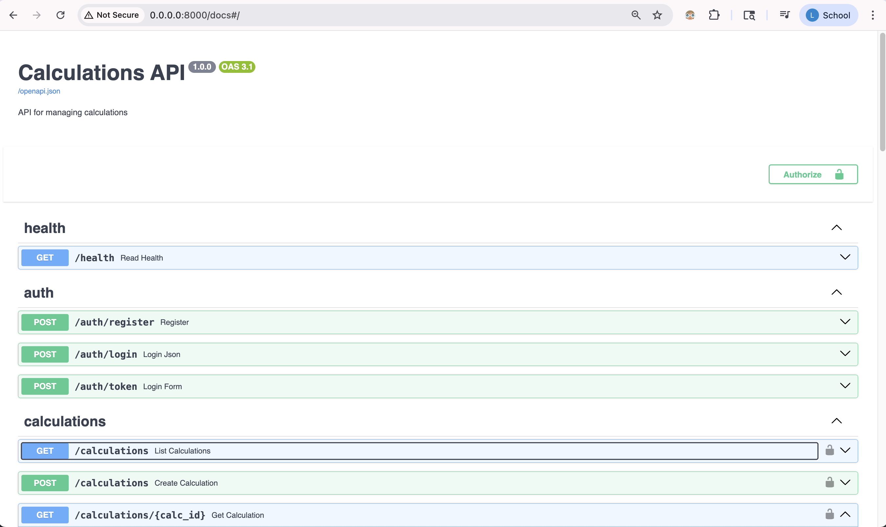
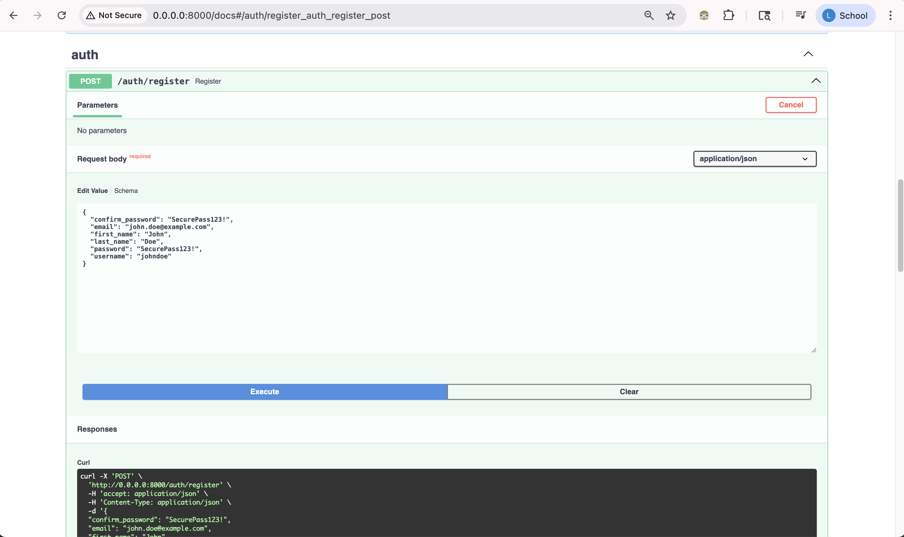
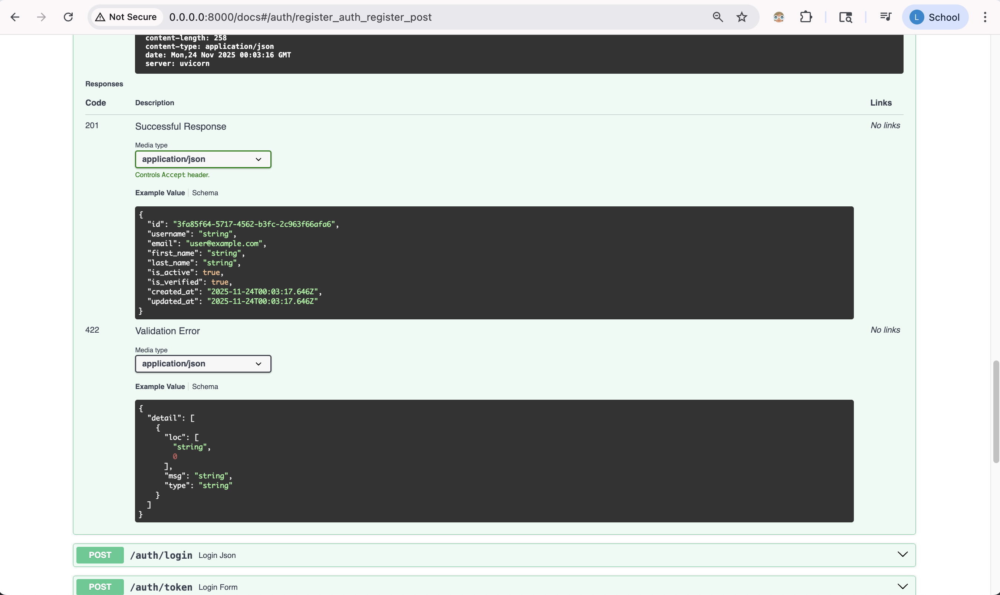
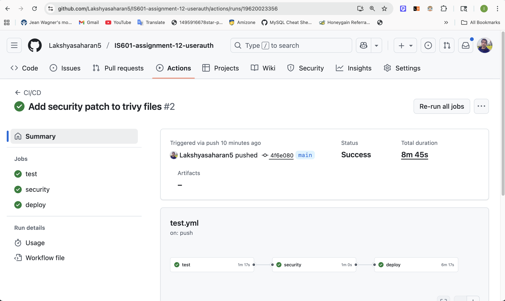
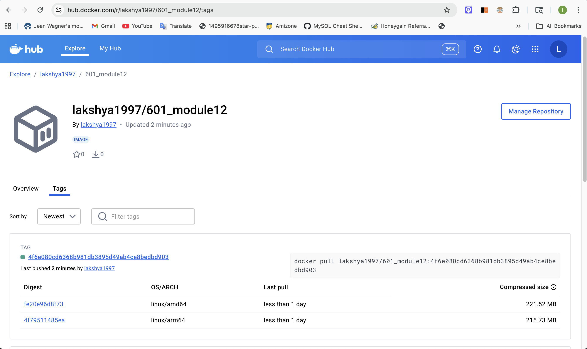

# IS601-assignment-12-userauth

Backend for user authenticated web based calculator

## Application screenshots








## Github Workflow Action Pipeline



## DockerHub Deploy

URL: <a href="https://hub.docker.com/r/lakshya1997/601_module12/tags">https://hub.docker.com/r/lakshya1997/601_module12/tags</a>



## Running tests

Be sure to create a pytest.ini file to specify the test directory paths and any additional Pytest configurations.

```bash
# Run integration tests
$ pytest tests/integration/

# Run end-to-end tests
$ pytest tests/e2e/

# Run unit tests for operations
$ pytest tests/unit/

# Run all tests (including those configured in conftest)
$ pytest
```


## Challenges

#### Package issues

- Redis dependency is deprecated in Python 3.13. I installed Python@3.10 and created new venv for redis and jwt tests to clear.

- bcrypt lib also causes issues so added specific version in requirements.txt which works with Passlib

#### Security patch issue

Security action workflow fails when running Tivy vulnerability scanner. 
To fix this, I added .tiryignore files with following Vulnerabilities:

- CVE-2025-43859
- CVE-2024-33663
- CVE-2025-62727

